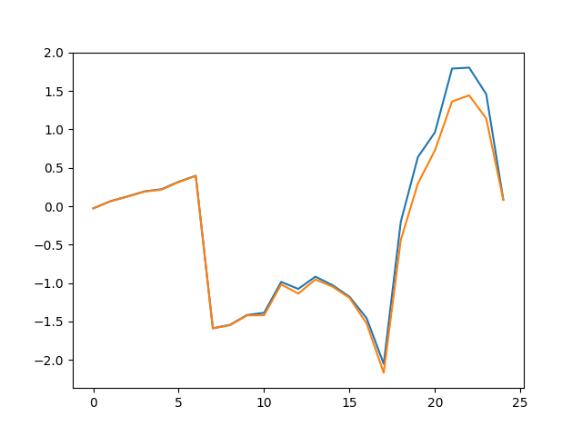

# LLM Internals Cert

This repo provides an experimental evaluation of LLM internals neural activation.
The integrity is then evaluated calculating the Jensen-Shannon divergence.

The model used in the experiments is `gpt-oss-20b`, on that is applied a soft fine tuning with QLoRA, then the integrity is calculated.

The experiments were conducted on an architecture composed of a K3S cluster with 4 GPUs (1 A40 and 3 L40S)

Evaluation steps:

```bash
run the gpt_assess.ipynb notebook
```

to fine-tune we used Unsloth Studio, the used configuration can be found in the `fine-tuning-unsloth/gpt_oss_20b_qlora.conf`

to calculate distance:

```bash
python analyze.py --comp-out-dir <saved outputs to compare>
```

> NOTE: the repo doesn't include the full merged model due to storage limits, the complete model can be downloaded from <a href="https://huggingface.co/alexdellabruna/gpt-oss-20b-qlora">Hugging Face Repo</a>, the QLoRA adapter can be downloaded from <a href="https://huggingface.co/alexdellabruna/gpt-oss-20b-qlora-adapter">Hugging Face Repo</a>

Results:

Final result: integral (JS Divergence: 0.061115286381893556)

